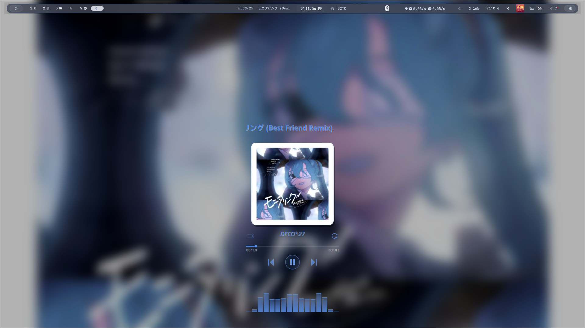

# Music Mode

An album-art-driven desktop customization system that transforms your Linux desktop into a dynamic music experience. When Spotify plays, a floating GTK widget appears with cover art, controls, and a live audio visualizer — while your wallpaper, Waybar, Hyprland borders, Rofi launcher, and Kitty terminal all synchronize to the track's color palette.



> **Note:** Add actual screenshots to the `screenshots/` directory.

## Why This Exists

Existing status bar widgets and music integrations are limited to small album art thumbnails or basic text. Music Mode was built to create a **full immersion experience** — turning your entire desktop into a canvas that reflects what you're listening to. Every element, from the wallpaper to the terminal, dynamically adapts to the current track's colors.

## Features

- **Floating GTK Widget** — 360×672px transparent overlay showing album art, song title, artist, progress bar, and transport controls
- **Live Audio Visualizer** — 16-bar frequency analyzer powered by cava, drawn with Cairo
- **Dynamic Wallpaper** — Blurred and darkened album art set as desktop wallpaper (swww on Hyprland, gsettings on Cinnamon)
- **Adaptive Color Sync** — Wallust generates a full color palette from each album; Hyprland borders, Waybar, Rofi, and Kitty all update in real-time
- **Crossfade Animations** — Cover art transitions with smooth opacity crossfades
- **Smart Marquee** — Song titles scroll when they exceed the display width
- **Progress Seeking** — Click and drag on the progress bar to seek within tracks
- **Volume OSD** — Scroll-wheel volume control with auto-fading overlay
- **Shuffle & Repeat** — Toggle indicators synced with Spotify
- **Fade In/Out** — Widget fades in when music plays, fades out when idle
- **Keyboard Shortcuts** — Space (play/pause), ←→ (seek), ↑↓ (volume), S (shuffle), R (repeat)
- **Right-click Context Menu** — Open Spotify, copy song info, hide widget
- **Wayland & X11 Support** — Native gtk-layer-shell on Hyprland, fallback to wmctrl on Cinnamon
- **Local File Support** — Extracts embedded cover art from local MP3 files via fuzzy filename matching
- **Systemd Service** — Runs as a user service with automatic restart

## Installation

### Prerequisites

- **Hyprland** (recommended) or Cinnamon/X11
- **Spotify** Desktop client (Premium recommended)
- **Python 3.12+** with pip
- **playerctl** — Media player control (`playerctl --player=spotify ...`)
- **cava** — Audio visualizer (≥0.10.7)
- **swww** — Wayland wallpaper daemon
- **wallust** — Color palette generator
- **ffmpeg** — Embedded cover art extraction (for local files)
- **ImageMagick** — Image processing fallback
- **curl** — Cover art downloads
- **Waybar** — Status bar (for color sync)
- **Rofi** — Application launcher (for theme sync)
- **Kitty** — Terminal emulator (for theme sync)

### Install Dependencies

**Arch Linux:**
```bash
sudo pacman -S python python-pip playerctl cava swww ffmpeg imagemagick curl waybar rofi kitty
# Install wallust from AUR
yay -S wallust
```

**Debian/Ubuntu:**
```bash
sudo apt install python3 python3-pip playerctl ffmpeg imagemagick curl waybar rofi kitty
# cava and swww may need manual compilation or AUR-equivalent
```

### Python Dependencies

```bash
pip install pygobject Pillow
```

### Clone and Setup

```bash
git clone https://github.com/YOUR_USERNAME/music-mode.git ~/music-mode
cd ~/music-mode

# Make scripts executable
chmod +x scripts/*.sh

# Install systemd user services
mkdir -p ~/.config/systemd/user
cp systemd/music-mode-widget.service ~/.config/systemd/user/
cp systemd/music-mode-art.service ~/.config/systemd/user/

# Reload and enable
systemctl --user daemon-reload
systemctl --user enable --now music-mode-widget.service
systemctl --user enable --now music-mode-art.service
```

### Config Files

The project expects these config directories:

```
~/.config/music-mode/         → theme-sync.sh and config overrides
~/.config/waybar/wallust/     → colors-bg.css, colors-waybar.css
~/.config/waybar/style/       → [WALLUST] ML4W-modern.css
~/.config/rofi/               → minimal-glass.rasi
~/.config/hypr/               → WindowRules.conf, UserDecorations.conf
~/.config/kitty/              → music-mode-theme.conf
```

These are typically symlinked or placed in your dotfiles. See the [Configuration](#configuration) section for details.

## Usage

### Starting Spotify

Once the services are running, simply start playing music in Spotify Desktop:

```bash
# Start Spotify
spotify &

# Or control via playerctl
playerctl --player=spotify play
```

The widget will automatically fade in when playback starts.

### Keyboard Shortcuts

| Key | Action |
|-----|--------|
| `Space` | Play/Pause |
| `←` | Seek backward 5s |
| `→` | Seek forward 5s |
| `↑` | Volume up |
| `↓` | Volume down |
| `S` | Toggle shuffle |
| `R` | Toggle repeat |
| `Right-click` | Context menu |

### Manual Controls

```bash
# Play/Pause
playerctl play-pause

# Next/Previous
playerctl next
playerctl previous

# Restart widget
systemctl --user restart music-mode-widget.service
```

## Configuration

### Environment Variables

| Variable | Required | Default | Purpose |
|----------|----------|---------|---------|
| `HYPRLAND_INSTANCE_SIGNATURE` | Auto | — | Detects Hyprland for swww/hyprctl |
| `WAYLAND_DISPLAY` | Auto | — | Detects Wayland for layer-shell |
| `DISPLAY` | Fallback | `:0` | X11 display for Cinnamon |
| `PYTHONUNBUFFERED` | No | `1` | Unbuffered Python output |

### Important Paths

| Path | Purpose |
|------|---------|
| `~/music-mode/cache/` | Runtime data: covers, colors, wallpaper, cava config |
| `~/Music/Spotify Local/` | Local MP3 files with embedded cover art |
| `~/.config/music-mode/theme-sync.sh` | Color sync daemon for Hyprland/Waybar/Rofi/Kitty |
| `~/.config/music-mode/theme-sync-override.conf` | Override colors for theme-sync |
| `~/.config/waybar/wallust/colors-bg.css` | Widget-written cover background color |
| `~/.config/waybar/wallust/colors-waybar.css` | Wallust-generated palette (16 colors) |
| `~/.config/waybar/colors.css` | theme-sync's accent color for Waybar |
| `~/.config/waybar/style/[WALLUST] ML4W-modern.css` | Active Waybar CSS (imports above) |
| `~/.config/hypr/UserConfigs/WindowRules.conf` | Widget window rules (nofocus, pin) |
| `~/.config/hypr/UserConfigs/UserDecorations.conf` | Auto-generated Hyprland border colors |

### Color Pipeline

```
Album Art
    │
    ├──→ Widget extracts perceptually-weighted average → colors-bg.css (cover-bg)
    │
    ├──→ swww sets blurred wallpaper → wallust generates colors-waybar.css
    │                                         │
    │                                         └──→ Widget reads color2 → desaturate 50% + darken 55%
    │                                                → contrast-push (dist≥60 from cover-bg)
    │                                                → color_accent.txt
    │                                                       │
    │                                                       └──→ theme-sync.sh →
    │                                                             ├── Hyprland borders
    │                                                             ├── waybar/colors.css
    │                                                             ├── rofi/colors.rasi
    │                                                             └── kitty/music-mode-theme.conf
    │
    └──→ Waybar imports all three CSS files for glassmorphism bar
```

## Built With

- **Python 3.12** — Core widget engine
- **GTK 3** (PyGObject) — Window and event loop
- **Cairo** — Custom 2D rendering (cover, bars, text, controls)
- **PangoCairo** — Text layout and rendering
- **Pillow** — Image processing (resize, blur, color extraction)
- **playerctl** — Spotify control via MPRIS D-Bus
- **cava** — Real-time audio frequency visualization
- **swww** — Wayland wallpaper daemon
- **wallust** — Wallpaper-derived color palette generation
- **ffmpeg** — Embedded cover art extraction
- **ImageMagick** — Image processing fallback
- **systemd** — User service management
- **Bash** — Startup scripts, color sync daemon, theme distribution
- **Hyprland** — Primary desktop environment (Wayland)
- **Waybar** — Status bar with dynamic CSS imports
- **Rofi** — Application launcher with dynamic theming
- **Kitty** — Terminal emulator with dynamic theming

## Project Structure

```
music-mode/
├── cache/                      # Runtime data (auto-generated)
│   ├── cover_*.jpg             # Processed album art
│   ├── cover_raw.jpg           # Downloaded raw art
│   ├── default_cover.jpg       # Fallback gradient
│   ├── wallpaper_blur.jpg      # Blurred desktop wallpaper
│   ├── color_accent.txt        # Extracted accent color
│   ├── color_brightness.txt    # Perceived brightness
│   ├── current_cover.txt       # Path to current cover
│   └── cava.cfg                # Cava audio visualizer config
│
├── scripts/
│   ├── autostart.sh            # Main startup (swww, widget, art fetcher)
│   ├── art.sh                  # Legacy art fetcher daemon
│   ├── launcher.sh             # XDG autostart wrapper
│   └── reload-colors.sh        # i3/Rofi color reloader
│
├── systemd/
│   ├── music-mode-widget.service   # systemd user service for widget
│   └── music-mode-art.service      # systemd user service for art fetcher
│
├── screenshots/                # Screenshots (add your own)
│
├── widget.py                   # Main GTK widget implementation
├── widget.log                  # Widget stdout/stderr
├── art.log                     # Art fetcher stdout/stderr
└── README.md                   # This file
```

## Architecture Overview

Music Mode runs as a **systemd user service** that launches a Python GTK3 widget. The widget polls Spotify via `playerctl` every 800ms and maintains several background threads:

1. **SpotifyTracker** — Polls track metadata, playback state, position, volume, shuffle/repeat
2. **ArtProcessor** — Downloads/extracts cover art, extracts colors, generates wallpaper, runs wallust
3. **CavaReader** — Spawns cava, reads raw frequency data, smooths bars with peak tracking
4. **WindowSinker** — Positions the widget on screen, sets nofocus/layer/pin via hyprctl

The widget draws everything with Cairo at an adaptive framerate (50ms when active, 500ms when idle). A static cached surface holds the album art and controls banner, while time labels are redrawn every frame for smooth progress updates.

Color changes propagate outward: the widget writes `colors-bg.css` (cover background), runs wallust for the palette, then `theme-sync.sh` distributes the accent color to Hyprland, Waybar, Rofi, and Kitty.

## Roadmap

- [ ] Full album art on wallpaper (remove blur, overlay track info)
- [ ] Multiple Spotify device support
- [ ] Last.fm scrobbling integration
- [ ] MPRIS generic player support (not just Spotify)
- [ ] PyPI package for easier installation
- [ ] GUI configuration panel
- [ ] MPD/ncmpcpp support
- [ ] Media key daemon (hardware keys without Spotify)

## Known Limitations

- **Spotify-only** — Relies on `playerctl --player=spotify`; other MPRIS players work partially
- **Single cover format** — Widget hardcoded to 270×270 JPG output
- **No multi-monitor selection** — Widget always appears on the primary display
- **cava stutter on high load** — Raw ASCII parsing can lag under CPU pressure
- **Local file cover extraction** — Not all embedded art formats are supported
- **Spotify must be running** — Widget is invisible when no player is detected

## Contributing

Contributions are welcome! Here's how to get started:

1. Fork the repository
2. Create a feature branch (`git checkout -b feature/amazing-feature`)
3. Make your changes
4. Test with `python widget.py` (stop the systemd service first)
5. Commit (`git commit -m 'Add amazing feature'`)
6. Push (`git push origin feature/amazing-feature`)
7. Open a Pull Request

### Code Style

- Python: PEP 8, 4-space indentation, no trailing whitespace
- Shell scripts: shellcheck-clean, `set -euo pipefail`
- GTK/Cairo: match existing drawing patterns; cache static surfaces
- Colors: use perceptually-weighted linear-RGB for extraction

## License

This project is licensed under the MIT License — see the [LICENSE](LICENSE) file for details.

## Author

**ByteByBody** — [bodyayman796@gmail.com](mailto:bodyayman796@gmail.com)

Built on top of [JaKooLit's Hyprland dotfiles](https://github.com/JaKooLit/Hyprland-Dots).
